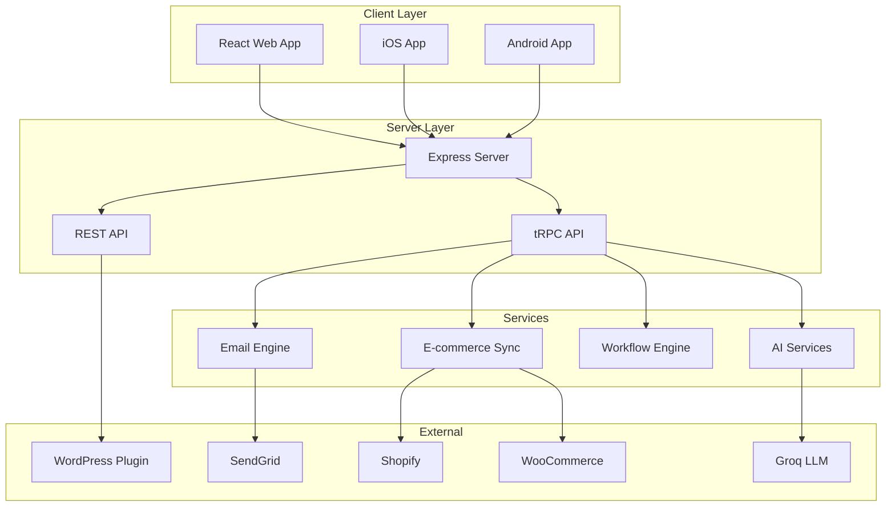

# Support Marketing Agent - Project Map

> **Version:** 2.01  
> **Last Updated:** January 11, 2026  
> **Overall Completion:** ~98%

---

## 🏗️ Architecture Overview

The Support Marketing Agent uses a **"Headless"** architecture where:
- **Node.js/React** serves as the central control plane
- **WordPress** acts as a data-source plugin
- **Capacitor** powers native iOS/Android mobile apps



---

## 📁 Directory Structure

```
Support_Marketing_Agent/
├── client/                    # React Frontend (Capacitor-enabled)
│   ├── src/                   # Application source (104 files)
│   ├── index.html
│   └── capacitor.config.ts    # Mobile app configuration
│
├── server/                    # Node.js Backend
│   ├── index.ts               # Express entry point
│   ├── routers.ts             # tRPC router aggregation
│   ├── routers/               # API endpoints
│   ├── services/              # Business logic
│   ├── workflows/             # Automation engine
│   ├── integrations/          # E-commerce connectors
│   ├── email/                 # Email sending system
│   ├── _core/                 # Core utilities
│   └── middleware/            # Express middleware
│
├── shared/                    # Shared code (types, constants)
│   ├── types.ts
│   └── const.ts
│
├── wordpress-plugin/          # WordPress integration plugin
│   ├── support-marketing-agent.php
│   ├── class-woosuite-backup.php
│   └── [66 files total]
│
├── drizzle/                   # Database migrations (19 files)
├── docs/                      # Documentation (19 files)
└── dist/                      # Production build output
```

---

## 🔌 Server Components

### API Endpoints (`server/routers/`)

| Router | File | Purpose |
|--------|------|---------|
| **AI** | `ai.ts` | Ticket classification, response generation, KB search |
| **AI Classification** | `aiClassification.ts` | Sentiment analysis, category detection |
| **Campaigns** | `campaigns.ts` | Email campaign CRUD, sending, analytics |
| **Contacts** | `contacts.ts` | Contact management, segmentation |
| **Contacts Import/Export** | `contactsImportExport.ts` | CSV import/export |
| **Integrations** | `integrations.ts` | E-commerce connection management |
| **License** | `license.ts` | License key validation |
| **Templates** | `templates.ts` | Email & workflow template library |
| **Workflows** | `workflows.ts` | Workflow CRUD, enrollment, triggers |

### AI Services (`server/services/ai/`)

| Service | Purpose |
|---------|---------|
| `analyticsService.ts` | AI usage and accuracy metrics |
| `contextBuilder.ts` | Builds conversation context for LLM |
| `feedbackService.ts` | Tracks AI response feedback |
| `groqService.ts` | Groq LLM API integration |
| `knowledgeBase.ts` | FAQ/KB article management |
| `ragService.ts` | Retrieval-Augmented Generation |
| `responseGenerator.ts` | AI-powered reply generation |
| `ticketClassifier.ts` | Category, priority, sentiment detection |
| `vectorStore.ts` | Embeddings for semantic search |

### Workflow Engine (`server/workflows/`)

| File | Purpose |
|------|---------|
| `engine.ts` | Workflow execution runtime |
| `scheduler.ts` | Delay/timing management (BullMQ) |
| `templates.ts` | 20+ pre-built workflow templates |
| `validator.ts` | Workflow validation rules engine |

### Email System (`server/email/`)

| File | Purpose |
|------|---------|
| `sendgrid.ts` | SendGrid API client |
| `queue.ts` | Email job queue (BullMQ) |
| `templates.ts` | Email template rendering (Handlebars) |
| `tracking.ts` | Open/click pixel tracking |
| `webhooks.ts` | SendGrid event handling |

### E-commerce Integrations (`server/integrations/`)

| File | Purpose |
|------|---------|
| `shopify.ts` | Shopify OAuth & API client |
| `woocommerce.ts` | WooCommerce REST API client |
| `syncEngine.ts` | Unified sync orchestration |

### Core Utilities (`server/_core/`)

| File | Purpose |
|------|---------|
| `llm.ts` | LLM abstraction layer |
| `voiceTranscription.ts` | Audio-to-text processing |
| `imageGeneration.ts` | AI image generation |
| `notification.ts` | Push notification service |
| `cookies.ts` | Cookie management |
| `env.ts` | Environment variable handling |
| `trpc.ts` | tRPC initialization |

---

## ✅ Feature Completion Status

### Core Platform & Licensing (100%)
- [x] Distributor-based license key system
- [x] Remote validation with dev fallback
- [x] Enterprise default for testing

### Mobile App (100%)
- [x] Capacitor iOS/Android wrappers
- [x] 99% code sharing with web

### WordPress Plugin (100%)
- [x] Chat widget, WooSync, shortcodes
- [x] Auto-built `support-marketing-agent.zip`

### AI Helpdesk (100%)
- [x] Ticket classification (category, priority, sentiment)
- [x] VIP/frustrated customer escalation
- [x] Knowledge base with RAG

### E-commerce Sync (100%)
- [x] Shopify & WooCommerce full sync
- [x] Webhook handlers for real-time updates

### Email Marketing (100%)
- [x] Campaign management & sending
- [x] Open/click tracking
- [x] SendGrid integration

### Workflow Automation (100%)
- [x] Visual drag-and-drop builder
- [x] 20+ pre-built templates
- [x] Validation engine

---

## 🔧 Key Technical Decisions

1. **Headless Architecture** — WordPress is a data source; React is the brain
2. **Capacitor for Mobile** — Best price/performance for native wrappers
3. **License Key Model** — Replaced Stripe billing with distributor licensing
4. **tRPC for API** — Type-safe end-to-end with TypeScript
5. **BullMQ Queues** — Background job processing (optional Redis)
6. **Drizzle ORM** — Type-safe database access

---

## 🚀 Deployment

| Component | Status | Delivery |
|-----------|--------|----------|
| WordPress Plugin | ✅ Ready | `support-marketing-agent.zip` |
| Web App | ✅ Ready | Docker/Node deployment |
| Mobile App | ✅ Ready | `npx cap open ios/android` |

### Environment Requirements
See `ENV_VARIABLES.md` for full configuration reference.

---

## 📋 Remaining Tasks

- [ ] API_REFERENCE.md documentation
- [ ] Deployment guide completion
- [ ] AI settings integration with agent
- [ ] End-to-end testing flows
- [ ] Demo data expansion (workflows, tickets, orders)

---

## 🔗 Related Documentation

| Document | Purpose |
|----------|---------|
| [SYSTEM.md](./SYSTEM.md) | Agent operational guidelines |
| [../IMPLEMENTATION_STATUS.md](../IMPLEMENTATION_STATUS.md) | Detailed feature status |
| [../DEPLOYMENT.md](../DEPLOYMENT.md) | Deployment instructions |
| [../ENV_VARIABLES.md](../ENV_VARIABLES.md) | Environment configuration |
| [../CONTRIBUTING.md](../CONTRIBUTING.md) | Contribution guidelines |
| [../todo.md](../todo.md) | Full task backlog |
